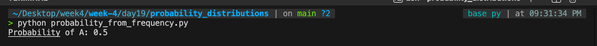

# Q1 Conceptual

PMF (Probability Mass Function) and PDF (Probability Density Function) both describe probability distributions, but they apply to different types of data.

- PMF is used for discrete random variables (countable values such as 0, 1, 2, 3). It gives the exact probability of each value.
  Example: Probability of getting exactly 3 heads in 5 coin tosses.

- PDF is used for continuous random variables (values over an interval such as height, weight, time). It gives probability density, so probability is found over a range, not at one exact point.
  Example: Probability that height lies between 160 cm and 170 cm.


# Q2 Coding 

```python
def probability_from_frequency(data, event):
    total = len(data)
    event_count = data.count(event)
    return event_count / total

# Example frequency data
data = ['A', 'B', 'A', 'C', 'A', 'B', 'A', 'C', 'B', 'A']

# Probability of event A
print("Probability of A:", probability_from_frequency(data, 'A'))

```

## File:-
### [`probability_from_frequency.py`](./probability_from_frequency.py)

## Output:-



# Q3 Conceptual 

- Central Limit Theorem (CLT):-
 states that if we repeatedly take samples from any population and compute their sample means, the distribution of those means tends to become normal as sample size increases, even if the original population is not normal.

## Why it is important in machine learning

- Many ML algorithms assume data errors or residuals are approximately normal.
- It allows reliable estimation of population parameters from sample data.
- It supports hypothesis testing, confidence intervals, and model evaluation.
- Large datasets in ML often naturally satisfy CLT, making statistical methods more stable.

## Example

Even if customer purchase amounts are skewed, the average purchase from many random samples tends to follow a normal distribution, helping build reliable predictive models.
