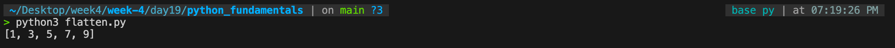

# Q1 - Conceptual

### What is the difference between loops, list comprehension, and higher-order functions in Python?

Loops, list comprehension, and higher-order functions are different ways to process collections of data in Python.

- Loops execute statements step by step and are best when logic is complex or requires multiple operations.
- List comprehension is a compact syntax used to create lists in a single line.
- Higher order functions such as map(), filter(), and reduce() apply a function to elements of a collection.

Example:

```python 
# Loop
squares = []
for x in [1, 2, 3, 4]:
    squares.append(x**2)

# List comprehension
squares = [x**2 for x in [1, 2, 3, 4]]

# Higher order function
squares = list(map(lambda x: x**2, [1, 2, 3, 4]))
```

### When would you use loops?
Use loops when the logic has multiple steps, conditions are complex, debugging is needed, or readability is important. Loops are easier to understand for longer logic.

### When would you use list comprehension?


Use list comprehension when a simple transformation is needed, a new list must be created, or code should be shorter and cleaner. It is usually faster and more concise than loops.


### When would you use higher-order functions?

Use higher-order functions when the same operation must be applied to many elements, functional programming style is preferred, or filtering or mapping data is required.

Examples:

- map() -> transform values
- filter() -> select values
- reduce() -> combine values


### Which approach is best in practice?

- Loops: for complex logic
- List comprehension:  for simple readable transformations
- Higher-order functions:  for reusable functional operations

# Q2. Coding 

```python
def flatten_remove_even(nested_list):
    return [num for sublist in nested_list for num in sublist if num % 2 != 0]

data = [[1, 2, 3], [4, 5, 6], [7, 8, 9]]

result = flatten_remove_even(data)

print(result)
```

### File Link :- 
- [`flatten.py`](./flatten.py) - 
Flattens a nested list and removes even numbers.


### Output:-



# Q3. Conceptual

### What is hypothesis testing?

Hypothesis testing is a statistical method used to determine whether sample data provides enough evidence to support or reject a claim about a population. It helps decide whether an observed result happened by chance or represents a real effect.


### What is the null hypothesis (H0)?

The null hypothesis (H0) is the default assumption that there is no effect, no difference, or no relationship between variables.

Example:
If two teaching methods are compared:

- ### H0: Both teaching methods produce the same average marks.
- ### H1: The teaching methods produce different average marks.


### What is a p-value?

A p-value is the probability of obtaining results as extreme as the observed data if the null hypothesis is true.

- Small p-value means strong evidence against H0
- Large p-value means weak evidence against H0

#### Example:
If p = 0.03, there is a 3% chance that the observed difference happened randomly when H0 is true.


### What is significance level (alpha)?

The significance level (alpha) is the threshold used to decide whether to reject the null hypothesis.

Common value:

- alpha = 0.05

Decision rule:

- If p-value < 0.05, reject H0
- If p-value >= 0.05, fail to reject H0


#### Example:-

Suppose two student groups use different teaching methods.

- Group A average = 72
- Group B average = 78
- Calculated p-value = 0.02

Since 0.02 < 0.05, reject H0.

This means the difference between the two teaching methods is statistically significant.
